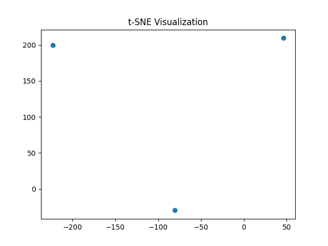
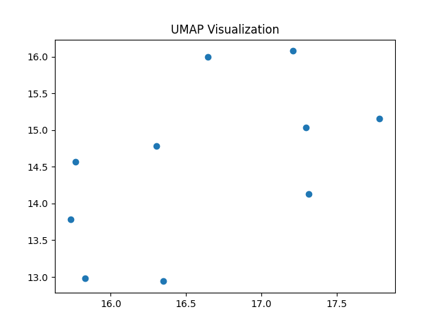
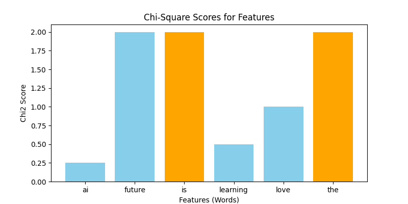

# NLP Dimensionality Reduction (PCA, t-SNE, UMAP) & Feature Selection

This repository contains Python scripts demonstrating **dimensionality reduction** and **feature selection** techniques in Natural Language Processing (NLP).

---

##  Files
- `1.Principal Component Analysis (PCA).py`  

  Demonstrates how to use **PCA** to reduce TF-IDF feature vectors into 2 dimensions for visualization.
  
- `2.t-SNE (t-distributed Stochastic Neighbor Embedding)`

  **t-SNE (t-distributed Stochastic Neighbor Embedding)** is a non-linear dimensionality reduction technique mainly used for visualizing high-dimensional data in 2D or 3D space.

- `3. UMAP (Uniform Manifold Approximation and Projection)`

  **UMAP (Uniform Manifold Approximation and Projection)** is a dimensionality reduction technique used in machine learning and data analysis. It is designed to reduce high-dimensional data to a lower-dimensional space (like 2D or 3D) while preserving the global and local structure of the data as much as possible.  

- `4.Feature Selection (SelectKBest with Chi-Square).py`  

  Demonstrates **Chi-Square feature selection** to select the most relevant features from count vectors. Includes visualization of Chi2 scores.

---

## Requirements
Install dependencies with:

```bash
pip install -r requirements.txt
```

---

### Dependencies
- scikit-learn
- matplotlibs
- numpy
- umap-learn

---
---

##  Example Output

### PCA
```
PCA Reduced Data:
[[ 0.13759916  0.57544887]
 [-0.77082821 -0.2031325 ]
 [ 0.63322906 -0.37231637]]
```
---
### t-SNE(t-distributed Stochastic Neighbor Embedding)



---
### UMAP



---
### feature_extraction (Chi-Square)
```
Selected Features:
[[0 0]
 [1 1]
 [0 0]]
Feature Names: ['is', 'the']
```

The Chi-Square script also generates a bar chart highlighting important features.


---
